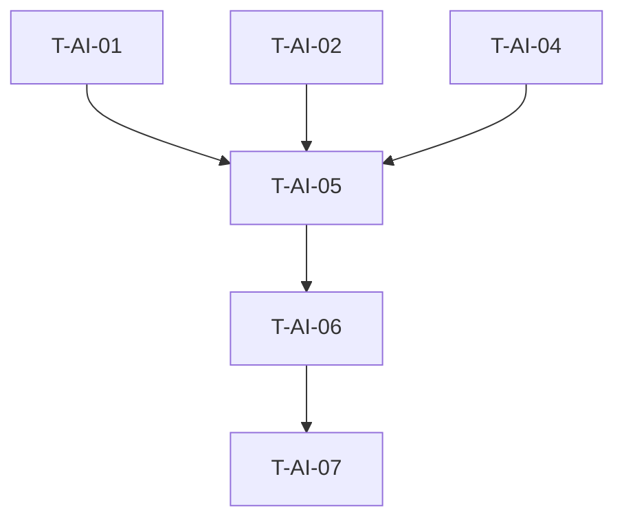

# Tasks — Módulo AI

## Tarefas de Implementação

| ID | Task | Prioridade | Complexidade |
|----|------|-----------|---------------|
| T-AI-01 | Implementar TriageService com LLMProvider | Must | Média |
| T-AI-02 | Implementar AIDraftService | Must | Média |
| T-AI-03 | Implementar FunnelClassificationService | Should | Baixa |
| T-AI-04 | Implementar JobQueue | Must | Alta |
| T-AI-05 | Implementar AIProcessingService | Must | Alta |
| T-AI-06 | Criar aiController com endpoints REST | Must | Baixa |
| T-AI-07 | Configurar WebSocket events | Should | Baixa |
| T-AI-08 | Adicionar retry em falhas de LLM | Should | Média |
| T-AI-09 | Adicionar cache de resultados | Could | Alta |

## Dependências entre Tasks

## Critérios de Done

- [ ] TriageService retorna department + confidence
- [ ] AIDraftService gera texto de resposta
- [ ] FunnelClassification classifica estágios
- [ ] JobQueue processa jobs com retry
- [ ] Endpoints REST respondem corretamente
- [ ] WebSocket emite eventos ai_complete

## Estimativa

| Task | Estimativa | Justificativa |
|------|------------|---------------|
| T-AI-01 | 4h | Integração LLM complexa |
| T-AI-02 | 3h | Prompt engineering necessário |
| T-AI-03 | 2h | Lógica de classificação simples |
| T-AI-04 | 6h | Fila com estados e retry |
| T-AI-05 | 4h | Orquestração |
| T-AI-06 | 2h | Rotas simples |
| T-AI-07 | 2h | Socket.io básico |
| Total | ~23h | |

---

🟡 INFERIDO — Baseado em análise de código similar