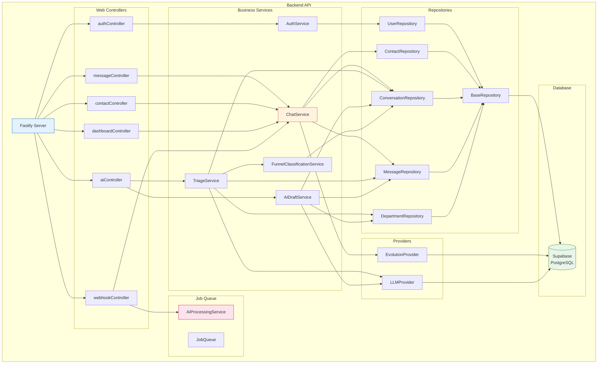
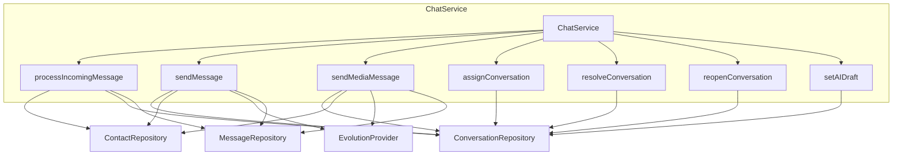
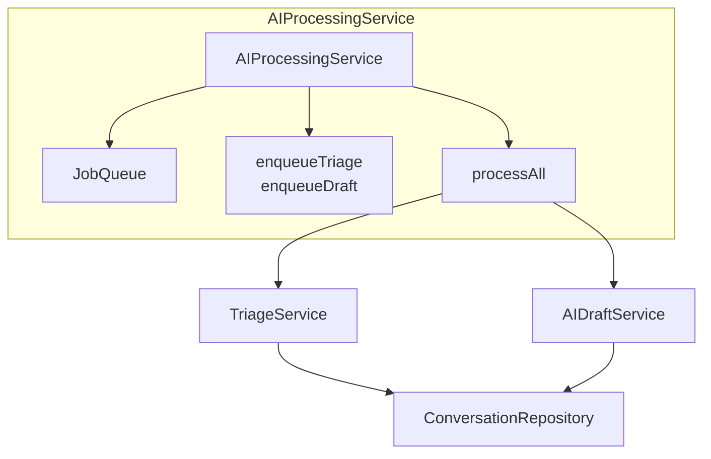
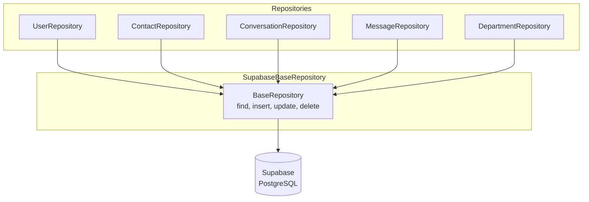

# C4 — Diagrama de Componentes

## Backend — Componentes Principais

## ChatService — Componente Central

## AI Processing Service

## Repositories — Padrão Repository

---

## Responsabilidades por Componente

| Componente | Responsabilidade |
|------------|-----------------|
| **AuthService** | Hash de senhas, geração e verificação de JWT |
| **ChatService** | Processamento de mensagens, criação de conversas, envio |
| **TriageService** | Classificação de mensagens para departamentos via LLM |
| **AIDraftService** | Geração de respostas sugeridas |
| **FunnelClassificationService** | Classificação de lead no funil de vendas |
| **JobQueue** | Fila de jobs para processamento assíncrono |
| **EvolutionProvider** | Abstração de chamadas para Evolution API |
| **LLMProvider** | Abstração de chamadas para provedores de IA |

🟢 CONFIRMADO — Baseado na análise de código