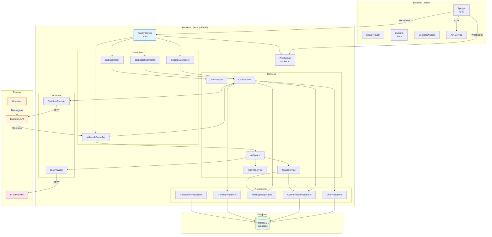

# C4 — Diagrama de Containers

## Visão de Containers

## Tecnologias por Container

| Container | Tecnologia | Porta | Responsabilidade |
|-----------|-----------|-------|-----------------|
| **Frontend** | React 18 + Vite | 5173 | UI do sistema |
| **Backend API** | Fastify 4.28 | 3001 | API REST |
| **WebSocket** | Socket.IO 4.8 | 3001 | Tempo real |
| **Database** | PostgreSQL + Supabase | - | Dados persistentes |
| **Evolution API** | Evolution API | externa | WhatsApp |
| **LLM Provider** | LLM (genérico) | externa | IA |

## Comunicação entre Containers

| De | Para | Protocolo | Descrição |
|----|------|-----------|-----------|
| Frontend | Backend | HTTP/REST | Operações CRUD |
| Frontend | WebSocket | WS | Tempo real |
| Backend | Database | PostgreSQL | Queries |
| Backend | Evolution | HTTP/REST | Enviar mensagens |
| Backend | LLM | HTTP/REST | Classificação |
| Evolution | Backend | Webhook | Mensagens recebidas |

🟢 CONFIRMADO — Baseado na análise de código