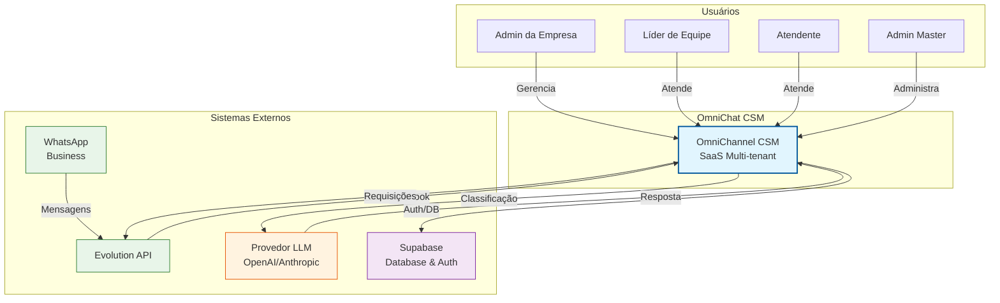
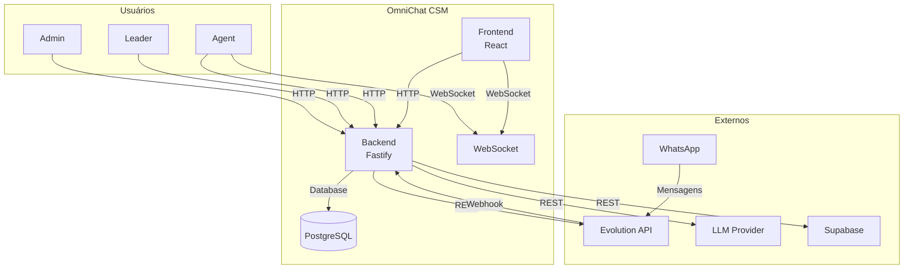

# C4 — Diagrama de Contexto

## Visão Geral

## Descrição dos Elementos

### Usuários

| Persona | Descrição | Acesso |
|---------|-----------|--------|
| **Master** | Administrador global do sistema | Todas as empresas |
| **Admin** | Administrador de uma empresa | Sua empresa completa |
| **Leader** | Líder de equipe de atendimento | Seu departamento |
| **Agent** | Atendente que responde conversas | Suas conversas atribuídas |

### Sistemas Externos

| Sistema | Função | Protocolo |
|---------|--------|-----------|
| **WhatsApp Business** | Canal de comunicação com clientes | WhatsApp Protocol |
| **Evolution API** | API que gerencia instâncias WhatsApp | REST HTTP |
| **Supabase** | Backend-as-a-Service (DB + Auth) | REST/PostgreSQL |
| **Provedor LLM** | IA para triagem e drafts | REST API |

### Fluxos Principais

1. **Mensagem Recebida**: WhatsApp → Evolution API → Webhook → OmniChat
2. **Mensagem Enviada**: OmniChat → Evolution API → WhatsApp
3. **Triagem IA**: OmniChat → LLM → Classificação
4. **Dados/Auth**: OmniChat ↔ Supabase

---

## Diagrama Expandido com Dados

🟢 CONFIRMADO — Baseado na análise de código