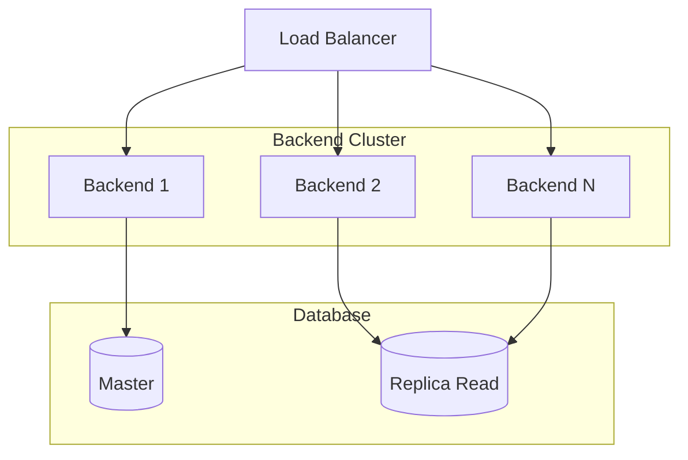

# Diagrama de Deployment

## Arquitetura de Infraestrutura

```mermaid
graph TB
    subgraph "Usuario"
        USER[Usuario<br/>Navegador]
    end

    subgraph "Rede Externa"
        CDN[CDN/Vercel<br/>Frontend estático]
        LB[Load Balancer<br/>(se necessário)]
    end

    subgraph "Docker Cluster"
        subgraph "Frontend Container"
            FE[Frontend React<br/>Port 5173]
        end

        subgraph "Backend Container"
            BE[Backend Node/Fastify<br/>Port 3000]
        end

        subgraph "Database Container"
            DB[PostgreSQL 16<br/>Port 5432]
        end
    end

    subgraph "Serviços Externos"
        SUPABASE[(Supabase<br/>Cloud)]
        EVOLUTION[Evolution API<br/>Instância]
        LLM[LLM Provider<br/>Groq/AI]
        WA[WhatsApp<br/>Business]
    end

    USER -->|HTTP/HTTPS| CDN
    CDN -->|Proxy| FE
    FE -->|HTTP/REST| LB
    LB -->|HTTP/REST| BE
    FE -->|WebSocket| BE

    BE -->|PostgreSQL| DB
    BE -->|REST| EVOLUTION
    BE -->|REST| SUPABASE
    BE -->|REST| LLM

    EVOLUTION -->|Webhook| BE
    WA -->|Mensagens| EVOLUTION

    style FE fill:#e3f2fd,stroke:#1565c0
    style BE fill:#e3f2fd,stroke:#1565c0
    style DB fill:#e8f5e9,stroke:#2e7d32
    style SUPABASE fill:#f3e5f5,stroke:#7b1fa2
```

## Configuração via Docker Compose

### Serviços

| Serviço | Imagem | Porta | Ambiente |
|---------|--------|-------|-----------|
| **postgres** | postgres:16-alpine | 5432 | DB |
| **backend** | custom (./backend) | 3000 | Node.js |
| **frontend** | custom (./frontend) | 5173 | Vite dev |

### Variáveis de Ambiente

```bash
# Database
DB_HOST=postgres
DB_PORT=5432
DB_USER=postgres
DB_PASSWORD=postgres
DB_NAME=omnichat

# LLM
LLM_PROVIDER=groq
LLM_API_KEY=<secret>
LLM_MODEL=llama-3.3-70b-versatile

# Evolution API
EVOLUTION_API_URL=<url>
EVOLUTION_API_KEY=<secret>
EVOLUTION_INSTANCE=<name>

# Auth
JWT_SECRET=<secret>
```

## Fluxo de Deployment

```mermaid
flowchart LR
    A[Desenvolvedor] --> B[Git Push]
    B --> C[CI/CD Pipeline]
    C --> D{Ambiente}
    D -->|Dev| E[Docker Compose Local]
    D -->|Staging| F[Docker Swarm/K8s]
    D -->|Prod| G[Cloud (Vercel/AWS)]

    E --> H[dev.omnichat.com]
    F --> I[staging.omnichat.com]
    G --> J[app.omnichat.com]
```

## Opções de Deployment

### 1. Docker Compose (Desenvolvimento)

```bash
docker-compose up --build
```

### 2. Vercel (Frontend)

```json
// vercel.json
{
  "rewrites": [
    { "source": "/api/(.*)", "destination": "/api/$1" },
    { "source": "/(.*)", "destination": "/index.html" }
  ]
}
```

### 3. Cloud (Produção Sugerida)

| Componente | Provedor | Opção |
|-----------|----------|-------|
| Frontend | Vercel/Netlify | Static + Edge |
| Backend | Railway/Render/Heroku | Node.js container |
| Database | Supabase/Neon | PostgreSQL gerenciado |
| Evolution API | Auto-hospedado ou managed | Instância Docker |
| LLM | Groq/OpenAI/Anthropic | API REST |

## Health Checks

```yaml
# docker-compose.yml
healthcheck:
  test: ["CMD-SHELL", "pg_isready -U postgres"]
  interval: 5s
  timeout: 5s
  retries: 5
```

## Volumes

| Volume | Caminho | Descrição |
|--------|---------|-----------|
| postgres_data | /var/lib/postgresql/data | Dados do PostgreSQL |
| backend | ./backend | Código fonte (dev) |
| frontend | ./frontend | Código fonte (dev) |

## Ports Mapeados

| Serviço | Interno | Externo | Protocolo |
|---------|---------|---------|-----------|
| PostgreSQL | 5432 | 5432 | TCP |
| Backend | 3000 | 3000 | HTTP |
| Frontend | 5173 | 5173 | HTTP |

---

## Cenário de Escalabilidade



### Estratégias de Scale

1. **Horizontal Scaling**: Múltiplas instâncias do backend atrás do load balancer
2. **Read Replica**: Para queries de leitura (dashboard)
3. **Caching**: Redis para sessões e dados frequentemente acessados
4. **Message Queue**: Para jobs de IA (evitar processamento síncrono)

---

## Segurança

| Camada | Medida |
|--------|--------|
| **Network** | TLS/HTTPS, firewall rules |
| **Application** | JWT validation, rate limiting |
| **Database** | Connection pooling, row-level security (Supabase) |
| **Secrets** | Environment variables, never commit secrets |

---

## Monitoramento

Sugerido (não implementado):
- Logs: Winston/Pino → Datadog/Loki
- Metrics: Prometheus + Grafana
- Tracing: OpenTelemetry

🟢 CONFIRMADO — Baseado em docker-compose.yml e Dockerfile