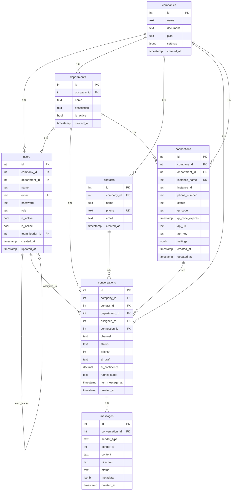

# ERD Completo — omni-channel

## Diagrama de Entidades e Relacionamentos



## Detalhamento das Entidades

### 1. companies

| Coluna | Tipo | PK | FK | Unique | Default | Nullable |
|--------|------|----|----|--------|---------|----------|
| id | SERIAL | ✅ | - | - | auto | NOT NULL |
| name | TEXT | - | - | - | - | NOT NULL |
| document | TEXT | - | - | - | NULL | ✅ |
| plan | TEXT | - | - | - | 'free' | ✅ |
| settings | JSONB | - | - | - | '{}' | ✅ |
| created_at | TIMESTAMP | - | - | - | NOW() | ✅ |

### 2. departments

| Coluna | Tipo | PK | FK | Unique | Default | Nullable |
|--------|------|----|----|--------|---------|----------|
| id | SERIAL | ✅ | - | - | auto | NOT NULL |
| company_id | INT | - | ✅ | - | - | NOT NULL |
| name | TEXT | - | - | - | - | NOT NULL |
| description | TEXT | - | - | - | NULL | ✅ |
| is_active | BOOLEAN | - | - | - | TRUE | ✅ |
| created_at | TIMESTAMP | - | - | - | NOW() | ✅ |

**Unique:** (company_id, name)

### 3. users

| Coluna | Tipo | PK | FK | Unique | Default | Nullable |
|--------|------|----|----|--------|---------|----------|
| id | SERIAL | ✅ | - | - | auto | NOT NULL |
| company_id | INT | - | ✅ | - | - | NOT NULL |
| department_id | INT | - | ✅ | - | NULL | ✅ |
| name | TEXT | - | - | - | - | NOT NULL |
| email | TEXT | - | - | ✅ | - | NOT NULL |
| password | TEXT | - | - | - | NULL | ✅ |
| role | TEXT | - | - | - | 'agent' | ✅ |
| is_active | BOOLEAN | - | - | - | TRUE | ✅ |
| is_online | BOOLEAN | - | - | - | FALSE | ✅ |
| team_leader_id | INT | - | ✅ | - | NULL | ✅ |
| created_at | TIMESTAMP | - | - | - | NOW() | ✅ |
| updated_at | TIMESTAMP | - | - | - | NOW() | ✅ |

### 4. contacts

| Coluna | Tipo | PK | FK | Unique | Default | Nullable |
|--------|------|----|----|--------|---------|----------|
| id | SERIAL | ✅ | - | - | auto | NOT NULL |
| company_id | INT | - | ✅ | - | - | NOT NULL |
| name | TEXT | - | - | - | NULL | ✅ |
| phone | TEXT | - | - | - | - | NOT NULL |
| email | TEXT | - | - | - | NULL | ✅ |
| created_at | TIMESTAMP | - | - | - | NOW() | ✅ |

**Unique:** (company_id, phone)

### 5. connections

| Coluna | Tipo | PK | FK | Unique | Default | Nullable |
|--------|------|----|----|--------|---------|----------|
| id | SERIAL | ✅ | - | - | auto | NOT NULL |
| company_id | INT | - | ✅ | - | - | NOT NULL |
| department_id | INT | - | ✅ | - | NULL | ✅ |
| instance_name | TEXT | - | - | - | - | NOT NULL |
| instance_id | TEXT | - | - | - | NULL | ✅ |
| phone_number | TEXT | - | - | - | - | NOT NULL |
| status | TEXT | - | - | - | 'offline' | ✅ |
| qr_code | TEXT | - | - | - | NULL | ✅ |
| qr_code_expires | TIMESTAMP | - | - | - | NULL | ✅ |
| api_url | TEXT | - | - | - | NULL | ✅ |
| api_key | TEXT | - | - | - | NULL | ✅ |
| settings | JSONB | - | - | - | '{}' | ✅ |
| created_at | TIMESTAMP | - | - | - | NOW() | ✅ |
| updated_at | TIMESTAMP | - | - | - | NOW() | ✅ |

**Unique:** (company_id, instance_name)

### 6. conversations

| Coluna | Tipo | PK | FK | Unique | Default | Nullable |
|--------|------|----|----|--------|---------|----------|
| id | SERIAL | ✅ | - | - | auto | NOT NULL |
| company_id | INT | - | ✅ | - | - | NOT NULL |
| contact_id | INT | - | ✅ | - | - | NOT NULL |
| department_id | INT | - | ✅ | - | NULL | ✅ |
| assigned_to | INT | - | ✅ | - | NULL | ✅ |
| connection_id | INT | - | ✅ | - | NULL | ✅ |
| channel | TEXT | - | - | - | 'whatsapp' | ✅ |
| status | TEXT | - | - | - | 'open' | ✅ |
| priority | INT | - | - | - | 0 | ✅ |
| ai_draft | TEXT | - | - | - | NULL | ✅ |
| ai_confidence | DECIMAL(3,2) | - | - | - | NULL | ✅ |
| funnel_stage | TEXT | - | - | - | 'unclassified' | ✅ |
| last_message_at | TIMESTAMP | - | - | - | NOW() | ✅ |
| created_at | TIMESTAMP | - | - | - | NOW() | ✅ |

### 7. messages

| Coluna | Tipo | PK | FK | Unique | Default | Nullable |
|--------|------|----|----|--------|---------|----------|
| id | SERIAL | ✅ | - | - | auto | NOT NULL |
| conversation_id | INT | - | ✅ | - | - | NOT NULL |
| sender_type | TEXT | - | - | - | 'contact' | ✅ |
| sender_id | INT | - | - | - | NULL | ✅ |
| content | TEXT | - | - | - | - | NOT NULL |
| direction | TEXT | - | - | - | 'incoming' | ✅ |
| status | TEXT | - | - | - | 'received' | ✅ |
| metadata | JSONB | - | - | - | NULL | ✅ |
| created_at | TIMESTAMP | - | - | - | NOW() | ✅ |

---

## Índices

| Índice | Tabela | Colunas |
|--------|--------|---------|
| idx_users_company | users | company_id |
| idx_users_department | users | department_id |
| idx_users_role | users | role |
| idx_conversations_company_status | conversations | company_id, status |
| idx_conversations_department | conversations | department_id |
| idx_conversations_assigned | conversations | assigned_to |
| idx_conversations_connection | conversations | connection_id |
| idx_messages_conversation | messages | conversation_id |
| idx_messages_created | messages | created_at |
| idx_contacts_company_phone | contacts | company_id, phone |
| idx_connections_company | connections | company_id |

---

## Relacionamentos Detalhados

```
companies (1) ──┬── (N) users
                ├── (N) departments
                ├── (N) contacts
                ├── (N) conversations
                └── (N) connections

departments (1) ──┬── (N) users
                  ├── (N) conversations
                  └── (N) connections

users (1) ──┬── (N) conversations (assigned_to)
            └── (N) users (team_leader_id)

contacts (1) ──── (N) conversations

conversations (1) ──┬── (N) messages
                   ├── (1) contacts
                   ├── (1) departments
                   ├── (1) users (assigned_to)
                   └── (1) connections
```

🟢 CONFIRMADO — Baseado em schema.sql