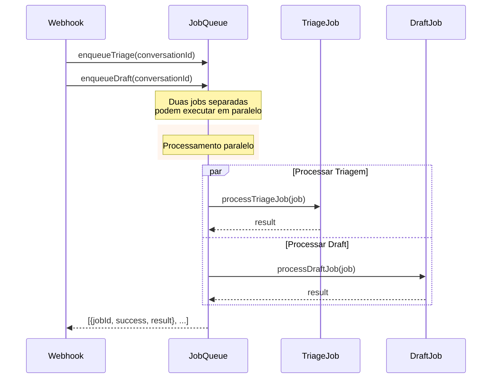
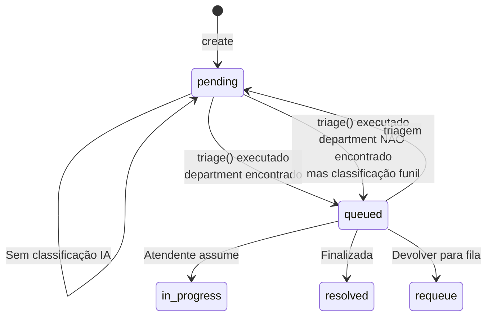

# Fluxo: AI - Triage (Função Principal)

## TriageService.triage() — Fluxo Detalhado

```mermaid
sequenceDiagram
    participant Caller as Caller<br/>(ChatService)
    participant Triage as TriageService
    participant MsgRepo as MessageRepository
    participant LLM as LLMProvider
    participant ConvRepo as ConversationRepository
    participant Funnel as FunnelClassificationService

    Caller->>Triage: triage(conversationId)
    
    rect rgb(240, 248, 255)
        note over Triage: 1. Buscar mensagens<br/>últimas 10 mensagens
    end
    
    Triage->>MsgRepo: getConversationHistory(conversationId, 10)
    MsgRepo-->>Triage: messages[]
    
    alt Nenhuma mensagem
        Triage-->>Caller: Error "No messages found"
    end
    
    rect rgb(240, 248, 255)
        note over Triage: 2. Formatar histórico<br/>para o prompt
    end
    
    note over Triage: Formatar:<br/>"Atendente (time): msg"<br/>"Aluno (time): msg"
    
    rect rgb(240, 248, 255)
        note over Triage: 3. Chamar LLM para<br/>classificação de dept
    end
    
    Triage->>LLM: classify(conversationHistory, departments, prompt)
    
    note over LLM: Prompt de triagem:<br/>"Você é um assistente<br/>de triagem de mensagens<br/>de uma escola técnica..."
    
    LLM-->>Triage: {content: "Comercial", usage: {...}}
    
    rect rgb(240, 248, 255)
        note over Triage: 4. Parsear resposta<br/>do departamento
    end
    
    Triage->>Triage: parseDepartment(response)
    
    note over Triage: Procura "Comercial", "Financeiro",<br/>"Secretaria" ou "Acadêmico" na resposta.<br/>Se não encontrar, retorna "Comercial"
    
    rect rgb(240, 248, 255)
        note over Triage: 5. Calcular confiança
    end
    
    note over Triage: confidence = Math.min(0.95, 0.3 + (1 - totalTokens/1000) * 0.3)<br/>Tokens menores = confiança maior

    rect rgb(240, 248, 255)
        note over Triage: 6. Classificar funil
    end
    
    Triage->>Funnel: classifyFromMessage(lastMessage, department)
    
    note over Funnel: Palavras-chave por estágio:<br/>- new: "interessado", "quero"<br/>- interested: "quanto", "preço"<br/>- negotiating: "parcelar", "desconto"<br/>- closed: "matricular", "vou"
    
    Funnel-->>Triage: {stage: "new", score: 0.3}
    
    rect rgb(240, 248, 255)
        note over Triage: 7. Atualizar conversa
    end
    
    Triage->>ConvRepo: update(conversationId, {
        departmentId: departmentResult?.id,
        status: departmentResult ? 'queued' : 'pending',
        aiConfidence: confidence,
        funnelStage: funnelResult?.stage
    })
    
    Triage-->>Caller: {
        conversationId,
        department: "Comercial",
        departmentId: 1,
        confidence: 0.85,
        funnel: {stage: "new", score: 0.3},
        rawResponse: "..."
    }
```

## Cálculo de Confiança

```mermaid
flowchart TD
    A[totalTokens = result.usage.total_tokens] --> B{totalTokens < 1}
    B -->|sim| C[confidence = 0.95]
    B -->|não| D{totalTokens < 1000}
    D -->|sim| E[confidence = 0.3 + (1 - tokens/1000) * 0.3]
    D -->|não| F[confidence = 0.3]
    
    E --> G[Math.min(0.95, result)]
    F --> G
    
    G --> H[0.3 ≤ confidence ≤ 0.95]
    
    note over A: Exemplo: 500 tokens<br/>confidence = 0.3 + 0.15 = 0.45
    
    note over H: Menos tokens = mais preciso = mais confiança
```

## Classificação de Funil

```mermaid
flowchart TD
    A[lastMessage] --> B{contains keywords?}
    
    B -->|"matricular", "vou", "assinar"| C[closed]
    B -->|"parcelar", "desconto", "negociar"| D[negotiating]
    B -->|"quanto", "preço", "valor", "tem"| E[interested]
    B -->|"interessado", "quero saber", "informações"| F[new]
    
    C --> G[score = 0.9]
    D --> H[score = 0.7]
    E --> I[score = 0.5]
    F --> J[score = 0.3]
    
    G --> K[return {stage, score}]
    H --> K
    I --> K
    J --> K
    
    note over A:department = 'Comercial'<br/>para funil de vendas
    note over K: default: funnel_stage = 'unclassified'
```

## Pipeline de Processamento de IA



## Estados de Conversa após Triagem

