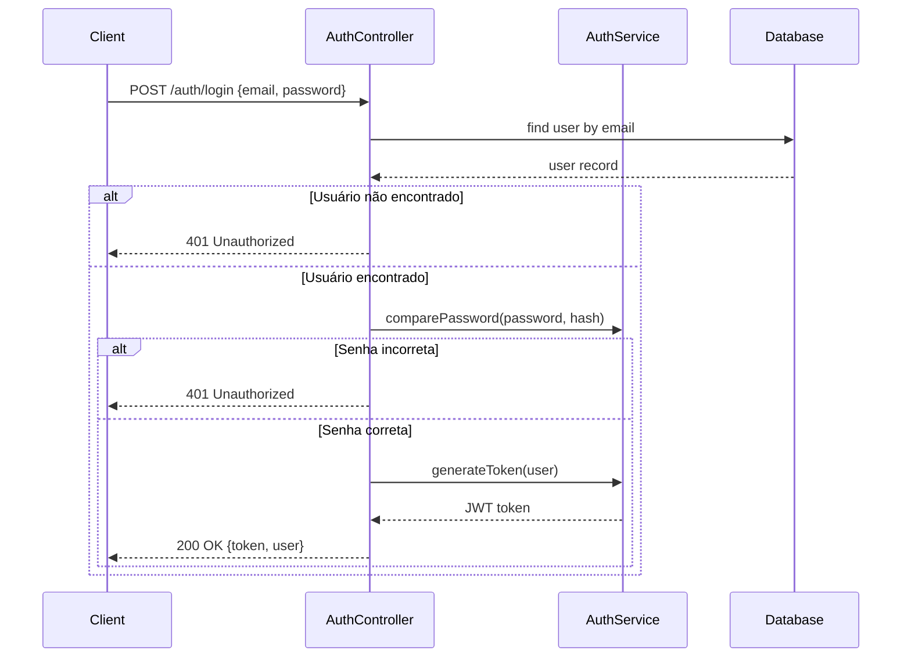
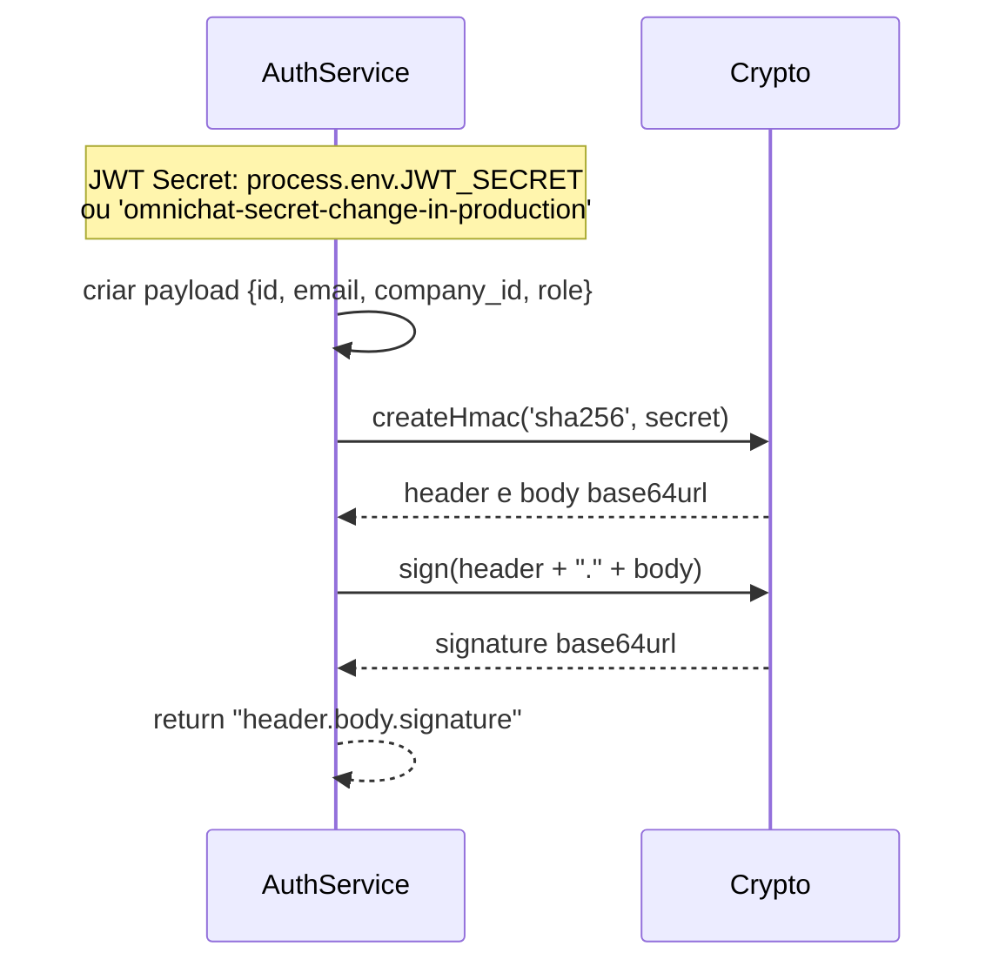
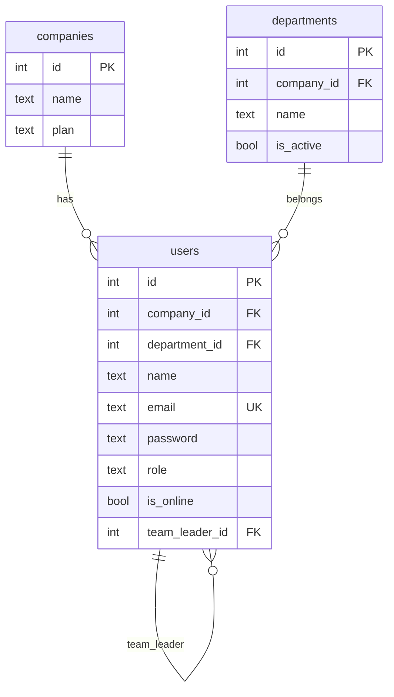

# Fluxo: Auth — omni-channel

## 1. Fluxo de Login



## 2. Fluxo de Geração de Token



## 3. Fluxo de Verificação de Token

```mermaid
flowchart TD
    A[Token recebido] --> B{Split por "."}
    B -->|3 partes| C[header, body, signature]
    B -->|não 3 partes| D[Retorna null]

    C --> E[Recalcular signature]
    E --> F{signature === expected?}
    F -->|não| D
    F -->|sim| G[Parse body base64]
    G --> H[Retorna payload]
```

## 4. Hierarquia de Permissões (RBAC)

```mermaid
flowchart TB
    subgraph Master
        M[Admin Global<br/>role: master]
    end

    subgraph Admin
        A[Admin Empresa<br/>role: admin]
    end

    subgraph Leader
        L[Líder Equipe<br/>role: leader]
    end

    subgraph Agent
        AG[Atendente<br/>role: agent]
    end

    M --> A
    A --> L
    L --> AG

    note over M: Acesso total a todas<br/>empresas e funcionalidades

    note over A: Acesso total à<br/>sua empresa

    note over L: Acesso à sua<br/>equipe

    note over AG: Apenas suas<br/>conversas atribuídas
```

## 5. Estrutura de Dados do Usuário

