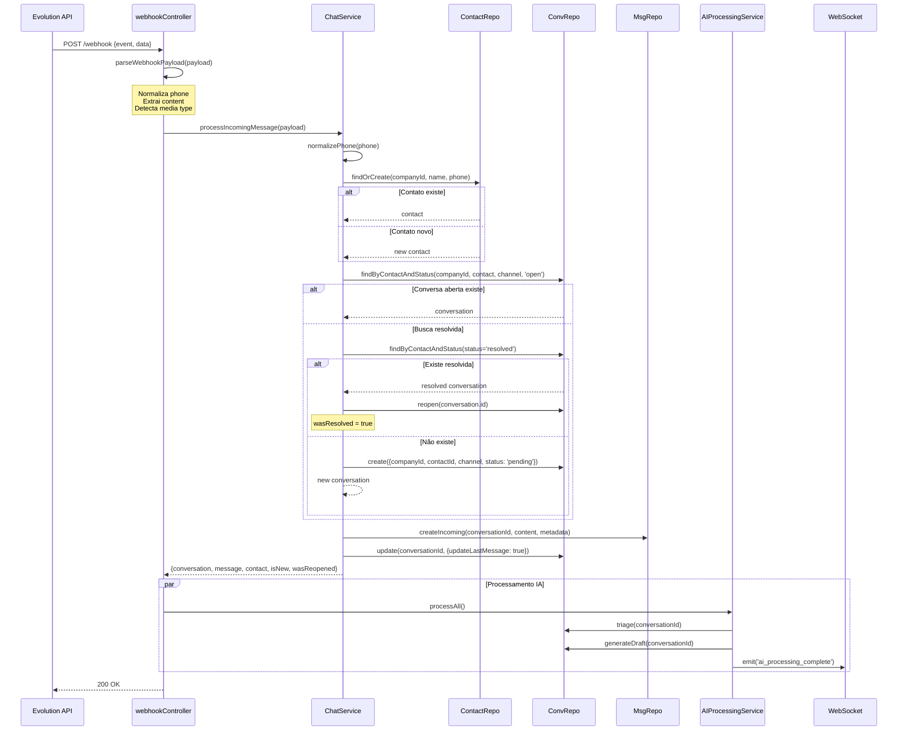
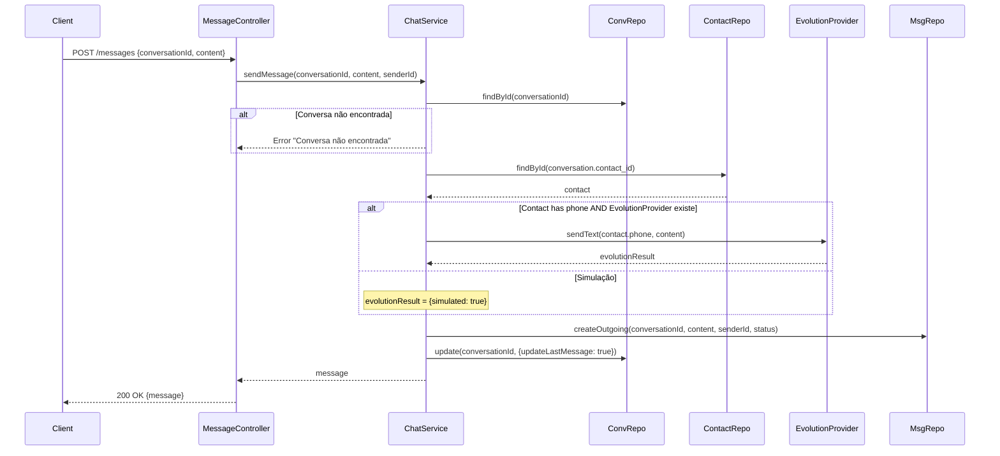
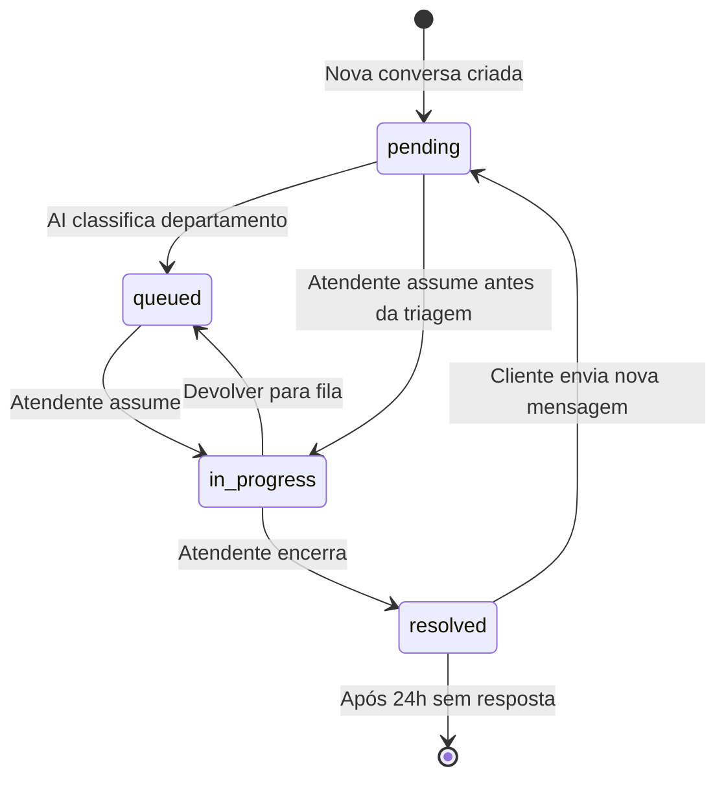
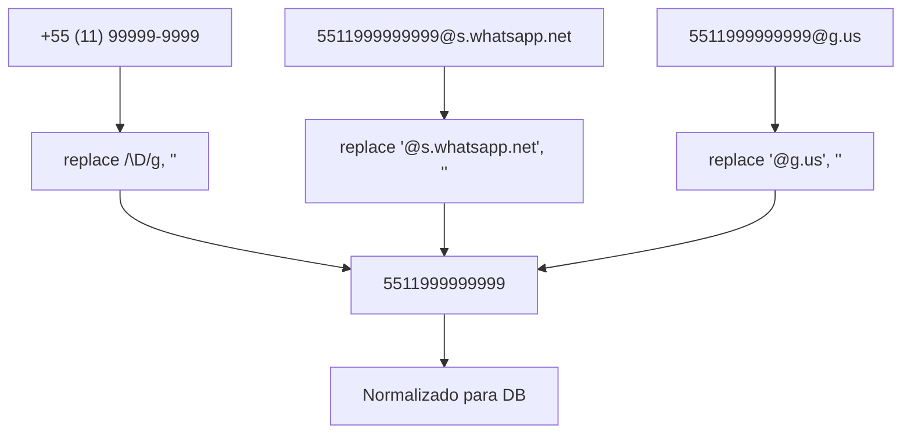
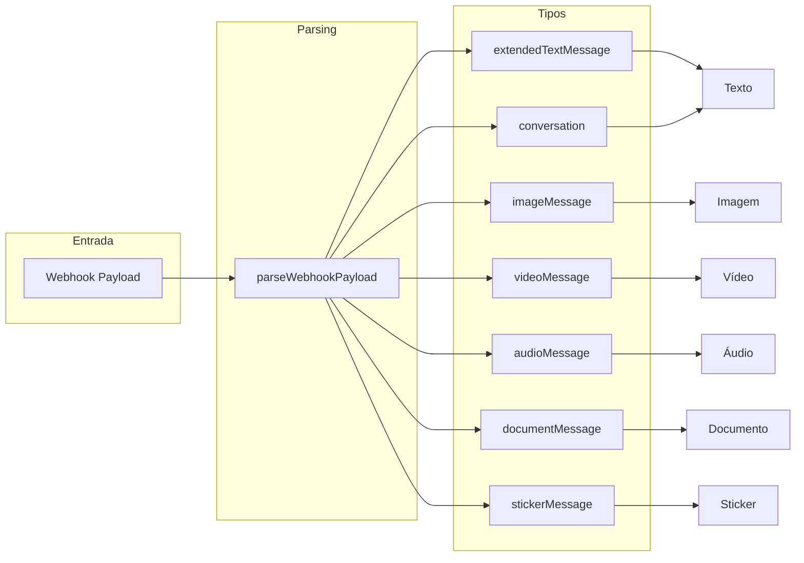

# Fluxo: Messages — omni-channel

## 1. Fluxo de Mensagem Recebida (Webhook)

## 2. Fluxo de Envio de Mensagem

## 3. Estados da Conversa

## 4. Normalização de Telefone

## 5. Tipos de Mídia Suportados

