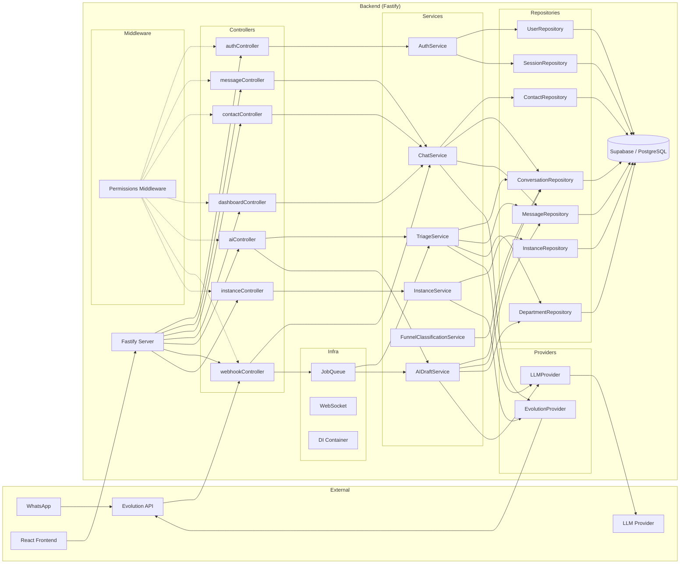

# Target Architecture

> Arquitetura alvo do sistema novo: idêntica à atual, com api/ migrado para o padrão package-by-layer do backend/.

## Visão geral

O sistema alvo mantém a arquitetura atual (Fastify + package-by-layer + DI + PostgreSQL/Supabase), com as funcionalidades ainda no api/ legado (instances management, permissions) migradas para o padrão de controllers → services → repositories → providers já estabelecido no backend/. Nenhuma mudança de paradigma, framework, banco ou topologia. O api/ e lib/ são removidos ao final.

## Diagrama (Mermaid)

## Componentes

| Componente | Tipo | Responsabilidade | Origem |
|---|---|---|---|
| authController | API | Login, register, refresh, logout | backend/ existente + novo refresh/logout |
| messageController | API | Envio de mensagens | backend/ existente |
| contactController | API | CRUD contatos | backend/ existente |
| dashboardController | API | Métricas e analytics | backend/ existente |
| aiController | API | Gatilhos de triagem e draft | backend/ existente |
| webhookController | API | Recebimento de mensagens via Evolution | backend/ existente |
| instanceController | API | CRUD instances + connect/disconnect | api/instances.js → migrado |
| AuthService | Serviço | Hash, JWT, refresh token | backend/ existente |
| ChatService | Serviço | Processamento de mensagens, envio | backend/ existente |
| TriageService | Serviço | Classificação IA por departamento | backend/ existente |
| AIDraftService | Serviço | Geração de drafts | backend/ existente |
| FunnelClassificationService | Serviço | Classificação funil de vendas | backend/ existente |
| InstanceService | Serviço | Lógica de connect/disconnect/QR | api/instances.js → migrado |
| UserRepository | Repositório | CRUD users | backend/ existente |
| ContactRepository | Repositório | CRUD contacts | backend/ existente |
| ConversationRepository | Repositório | CRUD conversations | backend/ existente |
| MessageRepository | Repositório | CRUD messages | backend/ existente |
| DepartmentRepository | Repositório | CRUD departments | backend/ existente |
| InstanceRepository | Repositório | CRUD instances | api/instances.js → migrado |
| SessionRepository | Repositório | Refresh tokens | novo (implementado) |
| EvolutionProvider | Provider | Abstraction Evolution API | backend/ existente |
| LLMProvider | Provider | Abstraction LLM calls | backend/ existente |
| Permissions Middleware | Middleware | RBAC check por role | lib/permissions.js → migrado |

## Bounded contexts

### BC-01: backend (unicampo)
- **Responsabilidade**: Todo o domínio — auth, messages, contacts, conversations, AI, dashboard, instances, websocket, webhooks
- **Justificativa**: Apenas um bounded context porque o sistema é um monolito coeso (SaaS omnichannel de atendimento) com acoplamento natural entre módulos (messages ↔ contacts ↔ conversations). A separação seria artificial e sem ganho real para o tamanho do time (1 dev) e complexidade do sistema.
- **Componentes internos**: Todos os controllers, services, repositories, providers, middlewares
- **Eventos publicados**: N/A (paradigma OO com DI conservador)

## Decisões arquiteturais (ADR-style resumido)

### AD-01: Migração de api/instances.js via Branch by Abstraction
- **Decisão**: Criar InstanceRepository + InstanceService no backend/, plugar no DI container, desligar api/
- **Alternativas descartadas**: Strangler Fig (complexo demais para 1 módulo), Big Bang (risco desnecessário)
- **Justificativa**: O api/ legado tem ~2 módulos restantes (instances, permissions). Criar abstrações no backend/ é mais rápido e seguro.
- **Rastreabilidade**: migration_strategy.md

### AD-02: Migração de lib/permissions.js para middleware Fastify
- **Decisão**: Criar middleware de permissões em backend/src/middlewares/permissions.js, registrado no DI container
- **Alternativas descartadas**: Manter como função utilitária (perde injeção de dependência)
- **Justificativa**: O padrão middleware Fastify permite check de role antes do handler, sem poluir controllers
- **Rastreabilidade**: target_business_rules.md → BR-MIGRAR-004 a BR-MIGRAR-020

### AD-03: Manter package-by-layer (preservar topologia legada)
- **Decisão**: Manter a atual estrutura controllers → services → repositories → providers → db
- **Alternativas descartadas**: Vertical slices (maior esforço sem ganho claro para o tamanho do sistema)
- **Justificativa**: Topologia atual é saudável, madura e bem compreendida. Mudar agora seria custo sem benefício.
- **Rastreabilidade**: topology_decision.md

## Honra ao paradigma escolhido

- **Paradigma alvo**: OO com DI (conservador)
- **Como a arquitetura honra esse paradigma**:
  - DI container (`dependencyInjection.js`) centraliza a injeção de dependências
  - Repositories e Services são classes instanciadas via DI
  - Controllers recebem services via constructor injection
  - Providers (Evolution, LLM) são abstrações injetadas nos services
  - Permissions middleware registrado no DI com acesso a repositories
  - InstanceService segue o mesmo padrão dos services existentes

## Bordas com o legado durante a migração

- Durante a migração (Branch by Abstraction), o api/ legado permanece ativo até que InstanceRepository + InstanceService + permissions middleware estejam validados
- Após validação, o roteador api/ é desligado
- Sem coexistência de rotas duplicadas: a migração é por substituição direta

## Notas

- Nenhuma mudança no schema do banco: as tabelas `connections` já existem e são usadas pelo backend/ atual
- Nenhuma mudança no frontend: as rotas permanecem as mesmas
- O permissions middleware deve ser adicionado como hook global ou por rota no Fastify
