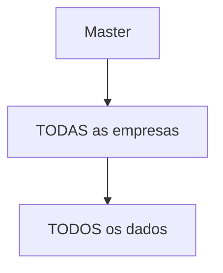
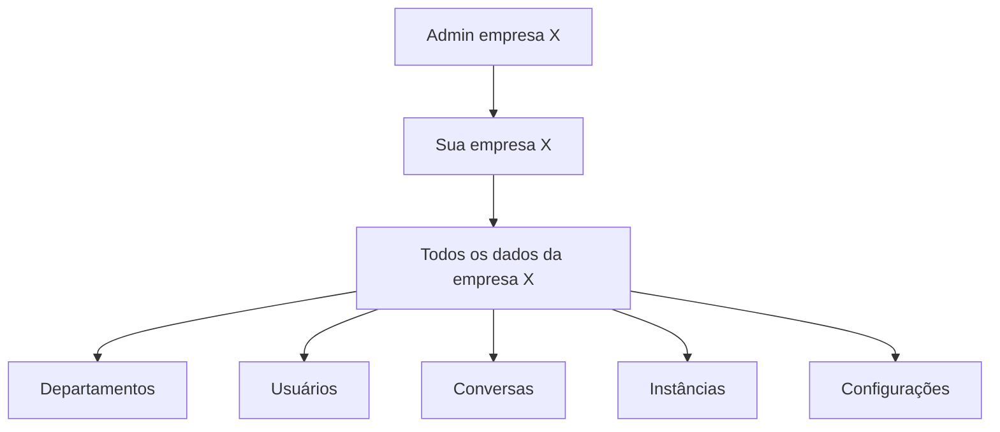
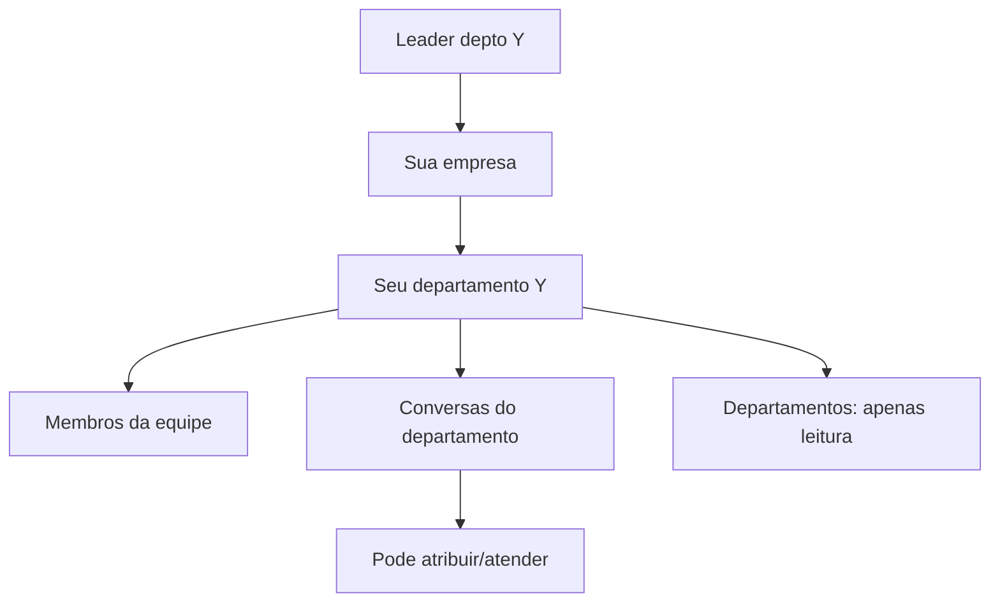
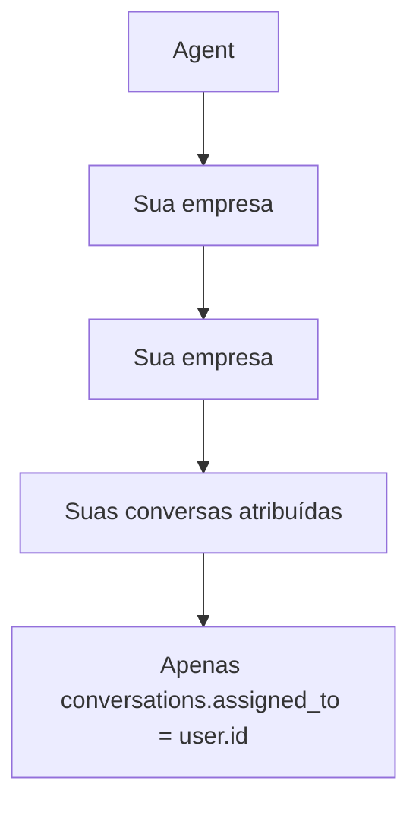
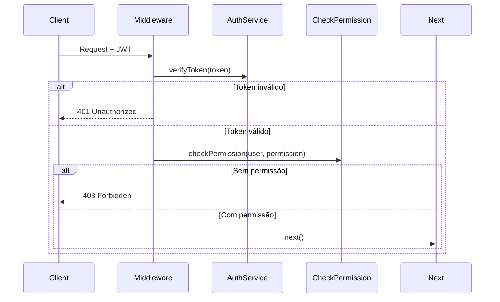

# Matriz de Permissões — omni-channel

> Nível: **detalhado**

---

## 1. Papéis do Sistema

| Papel | Descrição | Escopo |
|-------|-----------|--------|
| `master` | Administrador global | Todas as empresas |
| `admin` | Administrador da empresa | Sua empresa |
| `leader` | Líder de equipe | Seu departamento |
| `agent` | Atendente | Suas conversas |

---

## 2. Matriz de Permissões

### 2.1 Usuários

| Permissão | master | admin | leader | agent |
|-----------|--------|-------|--------|-------|
| `users:create` | ✅ | ✅ | ❌ | ❌ |
| `users:read` | ✅ | ✅ | ✅ | ❌ |
| `users:update` | ✅ | ✅ | ✅ | ❌ |
| `users:delete` | ✅ | ✅ | ❌ | ❌ |

### 2.2 Equipe

| Permissão | master | admin | leader | agent |
|-----------|--------|-------|--------|-------|
| `team:read` | ✅ | ✅ | ✅ | ❌ |
| `team:manage` | ✅ | ✅ | ✅ | ❌ |

### 2.3 Conversas

| Permissão | master | admin | leader | agent |
|-----------|--------|-------|--------|-------|
| `conversations:read` | ✅ | ✅ | ✅ | ✅ |
| `conversations:read_all` | ✅ | ✅ | ✅ | ❌ |
| `conversations:assign` | ✅ | ✅ | ✅ | ❌ |
| `conversations:transfer` | ✅ | ✅ | ✅ | ❌ |
| `conversations:resolve` | ✅ | ✅ | ✅ | ✅ |

### 2.4 Mensagens

| Permissão | master | admin | leader | agent |
|-----------|--------|-------|--------|-------|
| `messages:read` | ✅ | ✅ | ✅ | ✅ |
| `messages:send` | ✅ | ✅ | ✅ | ✅ |

### 2.5 Instâncias

| Permissão | master | admin | leader | agent |
|-----------|--------|-------|--------|-------|
| `instances:create` | ✅ | ✅ | ❌ | ❌ |
| `instances:read` | ✅ | ✅ | ✅ | ❌ |
| `instances:update` | ✅ | ✅ | ❌ | ❌ |
| `instances:delete` | ✅ | ✅ | ❌ | ❌ |
| `instances:connect` | ✅ | ✅ | ❌ | ❌ |

### 2.6 Configurações

| Permissão | master | admin | leader | agent |
|-----------|--------|-------|--------|-------|
| `settings:read` | ✅ | ✅ | ❌ | ❌ |
| `settings:write` | ✅ | ✅ | ❌ | ❌ |

### 2.7 Relatórios

| Permissão | master | admin | leader | agent |
|-----------|--------|-------|--------|-------|
| `reports:read` | ✅ | ✅ | ✅ | ❌ |
| `reports:export` | ✅ | ✅ | ❌ | ❌ |

### 2.8 Departamentos

| Permissão | master | admin | leader | agent |
|-----------|--------|-------|--------|-------|
| `departments:create` | ✅ | ✅ | ❌ | ❌ |
| `departments:read` | ✅ | ✅ | ✅ | ❌ |
| `departments:update` | ✅ | ✅ | ❌ | ❌ |
| `departments:delete` | ✅ | ✅ | ❌ | ❌ |

### 2.9 Empresas

| Permissão | master | admin | leader | agent |
|-----------|--------|-------|--------|-------|
| `companies:create` | ✅ | ❌ | ❌ | ❌ |
| `companies:read` | ✅ | ❌ | ❌ | ❌ |
| `companies:update` | ✅ | ❌ | ❌ | ❌ |
| `companies:delete` | ✅ | ❌ | ❌ | ❌ |

---

## 3. Visibilidade de Dados por Papel

### 3.1 Master



- Vê todas as empresas
- Acessa todas as funcionalidades
- Pode criar/editar/deletar empresas

### 3.2 Admin



- Vê apenas sua empresa
- Pode gerenciar usuários, departamentos, instâncias
- Pode visualizar relatórios completos

### 3.3 Leader



- Vê usuários e conversas do seu departamento
- Pode gerenciar (adicionar/remover) membros da equipe
- Pode atribuir conversas a agentes

### 3.4 Agent



- Vê apenas suas próprias conversas atribuídas
- Pode resolver suas próprias conversas
- Pode ler/escrever mensagens nas suas conversas

---

## 4. Regras de Filtro por Papel

### 4.1 filterByPermission()

```javascript
// Master e Admin veem tudo
if (user.role === 'master' || user.role === 'admin') {
  return data; // Sem filtro
}

// Líder vê conversas da equipe (departamento)
if (user.role === 'leader') {
  return data; // Filtrar por department_id se necessário
}

// Agent só vê as suas próprias conversas
if (user.role === 'agent' && field && user.id) {
  return data.filter(item => item[field] === user.id);
}
```

### 4.2 canAccessCompany()

```javascript
// Master acessa qualquer empresa
if (user.role === 'master') {
  return true;
}

// Admin/Leader/Agent só acessam sua própria empresa
return user.company_id === targetCompanyId;
```

---

## 5. Middleware de Permissão

### 5.1 requirePermission()

```javascript
function requirePermission(permission) {
  return (req, res, next) => {
    const user = req.user;
    
    if (!user) {
      return res.status(401).json({ ok: false, error: 'Não autenticado' });
    }
    
    if (!checkPermission(user, permission)) {
      return res.status(403).json({ 
        ok: false, 
        error: `Permissão negada: ${permission}`,
        your_role: user.role
      });
    }
    
    next();
  };
}
```

### 5.2 Fluxo de Verificação



---

## 6. Gaps e Lacunas

| Gap | Descrição | Confiança |
|-----|-----------|------------|
| 🔴 | Middleware de permissão verificado no código? | - |
| 🔴 | Todas as rotas do backend aplicam verificação? | - |
| 🔴 |Há granularidade mais fina (ex: agent pode ver mensagens de outros na mesma conversa)? | - |
| 🔴 |Rate limiting por role? | - |

---

## 7. Resumo Visual

```
┌─────────────────────────────────────────────────────────────┐
│                     HIERARQUIA DE ACESSO                     │
├─────────────────────────────────────────────────────────────┤
│  MASTER ──────────────────────────────────► acesso total    │
│    │                                                       │
│    ├── ADMIN ──────────────────────────────────► empresa    │
│    │    │                                                  │
│    │    ├── LEADER ──────────────────────────► departamento  │
│    │    │    │                                             │
│    │    │    └── AGENT ────────────────────► conversas     │
│    │    │         próprias                                       │
│    │    │                                                  │
│    │    └── (outros agents) ──────────────► suas conversas   │
│    │                                                       │
│    └── (outras empresas) ──────────────────► restrito       │
└─────────────────────────────────────────────────────────────┘
```

🟢 CONFIRMADO — Matrix baseada em `lib/permissions.js`