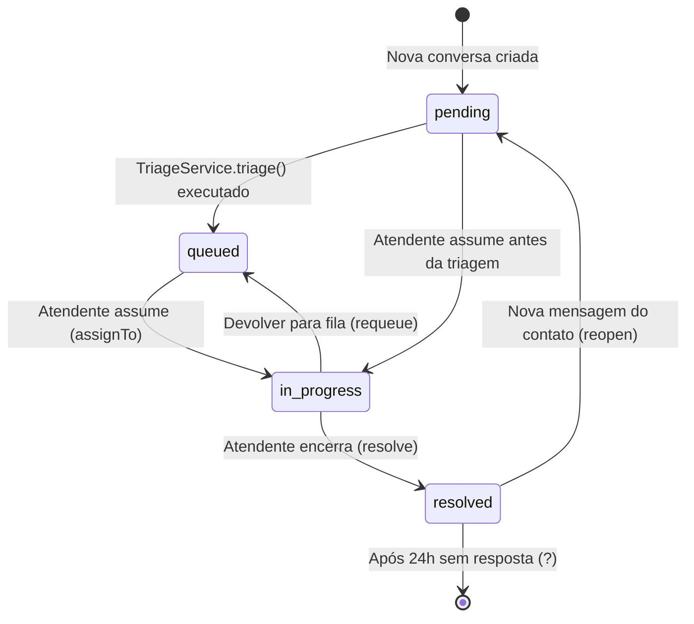
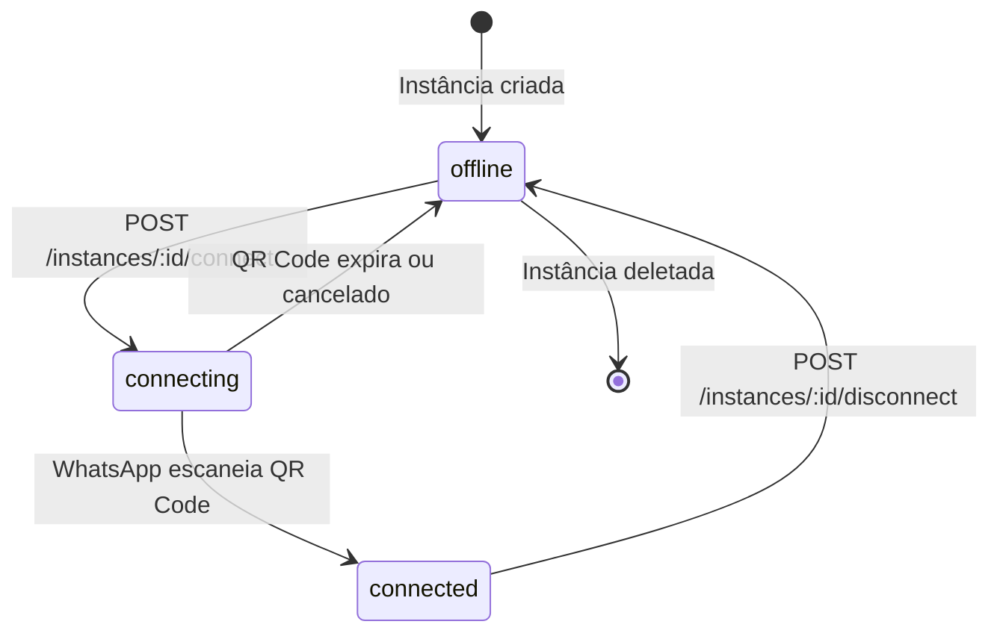
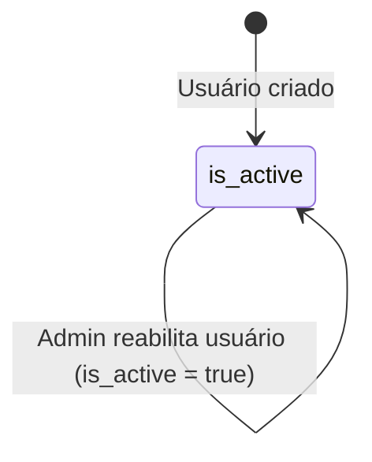
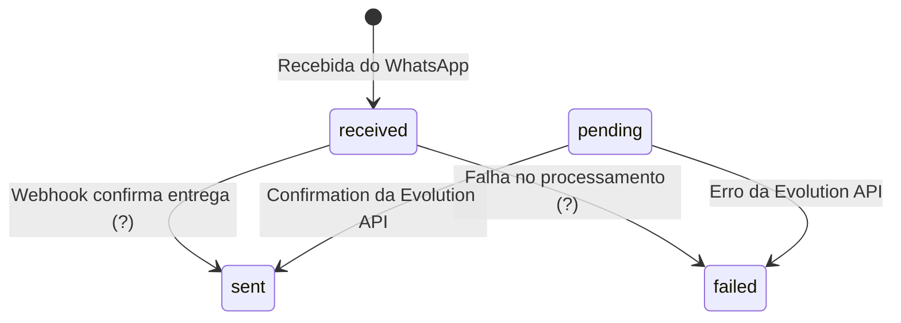
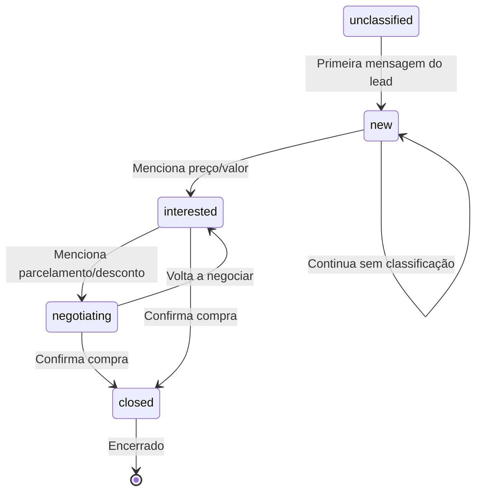
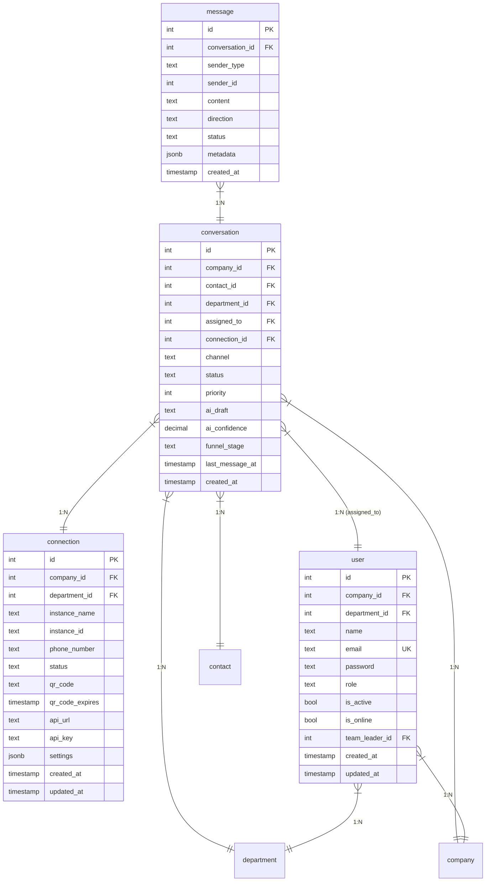

# Máquinas de Estado — omni-channel

> Nível: **detalhado**

---

## 1. Máquina de Estado: Conversa

### 1.1 Estados Possíveis

| Estado | Descrição | Origem |
|--------|-----------|--------|
| `pending` | Nova conversa, ainda não triada pela IA | `schema.sql:126` |
| `queued` | Triada pela IA, aguardando atribuicao | `TriageService.js:67` |
| `in_progress` | Em atendimento por um atendente | `ConversationRepository.js:135` |
| `open` | Estado genérico (usado em alguns selects) | `ChatService.js:20` |
| `resolved` | Encerrada pelo atendente | `ConversationRepository.js:139` |

### 1.2 Transições

### 1.3 Gatilhos de Transição

| De | Para | Gatilho | Código |
|----|------|---------|--------|
| pending | queued | `TriageService.triage()` atualiza department_id | `TriageService.js:65-70` |
| pending | in_progress | Atendente chama `assignTo()` antes da triagem | `ChatService.js:143-146` |
| queued | in_progress | `assignTo(conversationId, userId)` | `ConversationRepository.js:132-137` |
| in_progress | resolved | `resolve(conversationId)` | `ConversationRepository.js:139-141` |
| in_progress | queued | `requeue(conversationId)` | `ConversationRepository.js:143-148` |
| resolved | pending | Nova mensagem recebida em conversa resolvida | `ChatService.js:27-34` |

### 1.4 Estados com metadata

| Campo | Descrição |
|-------|------------|
| `department_id` | Departamento asignado (pode ser null se não triado) |
| `assigned_to` | ID do atendente que está atendiendo |
| `ai_draft` | Resposta sugerida pela IA |
| `ai_confidence` | Confiança da triagem (0.3 a 0.95) |
| `funnel_stage` | Estágio do funil de vendas |
| `priority` | Prioridade da conversa (maior = mais urgente) |
| `last_message_at` | Timestamp da última mensagem |

---

## 2. Máquina de Estado: Instância (Connection)

### 2.1 Estados Possíveis

| Estado | Descrição | Origem |
|--------|-----------|--------|
| `offline` | Instância desconectada do WhatsApp | `schema.sql:104` |
| `connecting` | Solicitada conexão, QR Code gerado e pendente | `instances.js:287` |
| `connected` | Instância conectada e ativa | `instances.js` (implicitamente) |

### 2.2 Transições

### 2.3 Gatilhos de Transição

| De | Para | Gatilho | Código |
|----|------|---------|--------|
| offline | connecting | `connectInstance()` | `instances.js:235-310` |
| connecting | connected | Webhook de status change da Evolution API | 🔴 LACUNA |
| connecting | offline | QR Code expira | `instances.js:289` (expira timestamp) |
| connected | offline | `disconnectInstance()` | `instances.js:318-351` |

### 2.4 Estados com metadata

| Campo | Descrição |
|-------|------------|
| `instance_name` | Nome único da instância |
| `instance_id` | ID na Evolution API |
| `phone_number` | Número WhatsApp |
| `qr_code` | QR Code em base64 |
| `qr_code_expires` | Timestamp de expiração |
| `api_url` | URL da Evolution API |
| `api_key` | Chave de API |

---

## 3. Máquina de Estado: Usuário

### 3.1 Estados Possíveis

| Estado | Descrição | Origem |
|--------|-----------|--------|
| `is_online` | Usuário está online no sistema | `schema.sql:57` |
| `is_active` | Usuário está ativo (não desabilitado) | `schema.sql:56` |

### 3.2 Transições

---

## 4. Máquina de Estado: Mensagem

### 4.1 Estados Possíveis

| Estado | Descrição | Origem |
|--------|-----------|--------|
| `received` | Mensagem recebida do contato | `schema.sql:145` |
| `sent` | Mensagem enviada com sucesso | `ChatService.js:170` |
| `pending` | Mensagem enviada mas ainda não confirmada | `ChatService.js:170` |
| `failed` | Falha ao enviar | `ChatService.js:170` |

### 4.2 Transições

🟡 INFERIDO — Não verificado explicitamente no código, pode haver mais estados.

---

## 5. Máquina de Estado: Funil de Vendas

### 5.1 Estados Possíveis

| Estado | Descrição |
|--------|-----------|
| `unclassified` | Não classificado |
| `new` | Novo lead |
| `interested` | Interessado |
| `negotiating` | Em negociação |
| `closed` | Fechado (cliente) |

### 5.2 Transições

🟡 INFERIDO — Lógica exata de transição não verificada no FunnelClassificationService.

---

## 6. Diagrama Completo de Estados das Entidades

---

## 7. Observações

1. **Estado default de conversation**: `status = 'open'` no schema, mas na prática os fluxos usam `pending` para novas conversas.

2. **Reabertura automática**: Quando um contato envía mensagem em conversa resolvida, o sistema automaticamente "reabre" a conversa (via `ChatService.js:27-34`).

3. **QR Code expira**: O timestamp `qr_code_expires` indica que há uma janela de tempo para escanear o QR Code.

4. **Confiança de triagem**: Baseada no número de tokens da resposta do LLM — menos tokens = resposta mais direta = maior confiança.

🟢 CONFIRMADO na maioria, 🟡 INFERIDO em algumas transições não verificadas explicitamente.